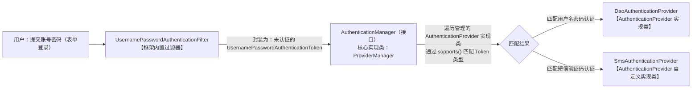
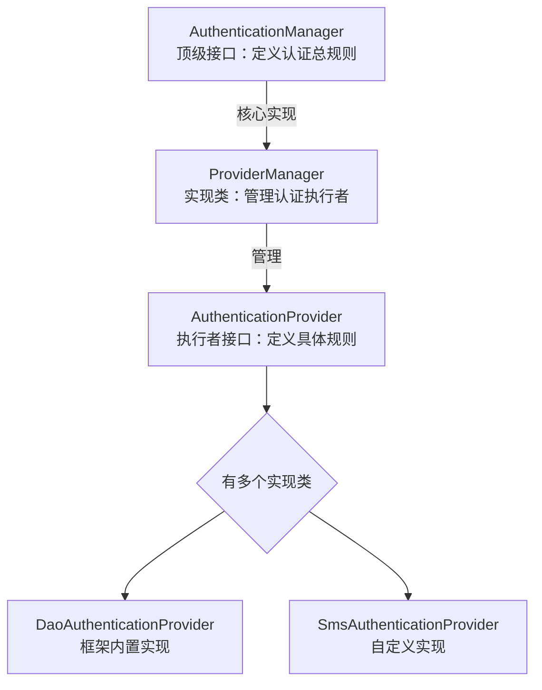
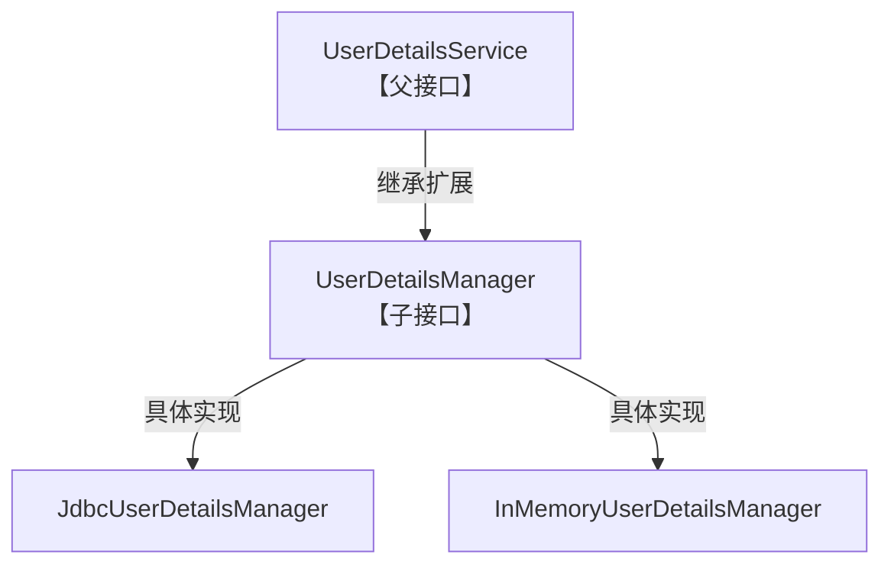
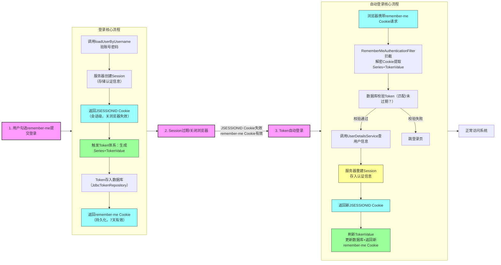
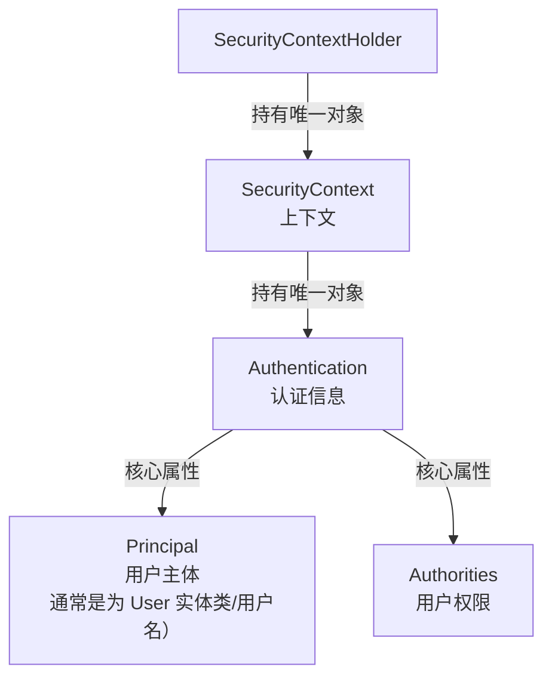

## 常见的网路攻击方法

### CSRF

#### 基本概念

* Cross-Site Request Forgery ，跨站请求伪造。诱导**已登录目标网站**（如银行账户）的用户，在其不知情的情况下，向目标网站发送一条攻击者构造的恶意请求（如转账请求）。此时由于用户已登录目标网站，因此会执行该恶意操作，从而达成攻击目的。

* **核心本质**：**冒用用户身份，在用户不知情时代其发起非法请求**。

* **核心原因**：服务器只验证凭证（Session / Cookie）是否有效，**不验证请求是否由用户主动发起**。

#### 举个例子

```html
<!DOCTYPE html>
<html lang="en">
<head>
    <meta charset="UTF-8">
    <title>坤坤炒粉放鸡精视频在线观看</title>
    <script src="https://unpkg.com/axios@1.1.2/dist/axios.min.js"></script>
</head>
<body>
<iframe name="hiddenIframe" hidden></iframe>
<form action="http://localhost:8080/mvc/pay" method="post" target="hiddenIframe">
    <input type="text" name="account" value="黑客" hidden>
    <button type="submit">点击下载全套视频</button>
</form>
</body>
</html>
```
> 这个有一个 hidden 的表单，用户只能看到一个 button 。当点击时，该恶意网站将向表单目标地址发一个请求。

```Java
// 转账接口
    @ResponseBody
    @PostMapping("/pay")
    public JSONObject pay(
            @RequestParam(value = "account", required = false) String account,
            HttpSession session) {
        JSONObject object = new JSONObject();
        // 严谨校验登录状态
        boolean isLogged = session != null && Boolean.TRUE.equals(session.getAttribute("isLogged"));
        if (isLogged) {
            System.out.println("Transfer to " + account + "succeeded ! Transaction accomplished");
            object.put("success", true);
        } else {
            System.out.println("Transfer to " + account + "failed ! Not logged in");
            object.put("success", false);
        }
        return object;
    }
```
> 目标网站接到请求，发现用户已经登陆过。所以不管该请求是否是用户主动发出的，都执行相应动作。然后发现自动向 hacker 转账成功了。

#### 解决方法

可以利用 [SpringSecurity](#csrf_info) 解决。并且现在浏览器都有 SameSite 保护机制，当用户在两个不同域名的站点操作时，默认情况下 Cookie 就会被自动屏蔽。

### SFA

#### 核心原理

hacker 预先获取一个合法的 SessionID ，然后诱使用户通过这个 SessionID 进行登录。登陆后，这个 ID 对应的 Session 中的相应属性（比如我经常用的 isLoggedIn ） 就会被置为登录态。这样一来， hacker 就可以拿着这个 SessionID 去直接登录用户的账户了。

* **根本原因**：**服务端登录成功后没有刷新 SessionID，导致前后共用同一个 ID**。

#### 举个例子

```html
<!DOCTYPE html>
<html lang="en">
<head>
    <meta charset="UTF-8">
    <title>坤坤炒粉放鸡精视频在线观看</title>
    <script src="https://unpkg.com/axios@1.1.2/dist/axios.min.js"></script>
</head>
<body>
<script>
    //第三方网站恶意脚本，自动修改 Cookie 信息
    document.cookie = "JSESSIONID= 这里是 hacker 的 SessionID ; path=/mvc; domain=localhost"
    // 跳转至目标网站
    location.href = 'http://localhost:8080/SFA/login'
</script>
</body>
</html>
```

现在有两个一样的登录页面：页面 A 与页面 B 。

* **页面 A**： hacker 的，hacker 打开这个页面时得到了服务端为其分配的 JSESSIONID ， hacker 将其填至攻击网站中。 
* **页面 B**： 用户通过恶意网站跳转到的登录页面。

现在用户在页面 B 上完成登录。由于用户使用的是 hacker 的SessionID ，所以 hacker 登录了。只要刷新页面 A ，就会发现直接进入主页了。

#### 解决方法

登录后强制刷新 SessionID 。当然 SpringSecurity 也可以自动防范。

### XSS

攻击者向网页里注入恶意 JavaScript 代码，让用户的浏览器自动执行这段脚本，从而偷数据、偷登录态、劫持账号。

## 配置与依赖

### Maven 依赖

```xml
<dependency>
            <groupId>org.springframework.security</groupId>
            <artifactId>spring-security-web</artifactId>
            <version>6.2.4</version>
</dependency>
<dependency>
            <groupId>org.springframework.security</groupId>
            <artifactId>spring-security-config</artifactId>
            <version>6.2.4</version>
</dependency>

```

### 配置类

1. 新建配置类 SecurityConfiguration

2. 在 MainInitializer 中，和 SpringConfiguration 一样配置即可。

3. 额外多一个 initializer ：SecurityInitializer ，继承 AbstractSecurityWebApplicationInitializer ，里面什么都不用写。

```Java
@Configuration
@EnableWebSecurity   //开启WebSecurity相关功能
public class SecurityConfiguration {
		
}
```

```Java
public class MainInitializer extends AbstractAnnotationConfigDispatcherServletInitializer {
    @Override
    protected Class<?>[] getRootConfigClasses() {
        return new Class[]{SpringConfiguration.class, SecurityConfiguration.class};   //基本的Spring配置类，一般用于业务层配置
    }
}
```

```Java
public class SecurityInitializer extends AbstractSecurityWebApplicationInitializer {

}
```

#### 一些琐碎的东西
SpringSecurity 自带 `FilterChain` 过滤器链，会拦截初始的全部请求，包括静态资源。此时不建议我们对于登录页面再设定`Interceptor`，否则非常容易与SpringSecurity的`FilterChain`冲突，导致一些非常离谱的结果:
```java
  此时访问的URL为http://localhost:8080/BookManagement/index

 // 不是静态资源或登录页面，重定向并拦截
        if(!url.contains("/static/") && !url.endsWith("login")) {
            HttpSession session = request.getSession();
            User user = (User) session.getAttribute("user");
            if(user == null) {
                response.sendRedirect("/BookManagement/login");
                return false;
            }
        }

        return true;
```
我们不妨分析一下。首先明确一个顺序:==`FilterChain`过滤器链会先执行，然后才会执行`Interceptor`拦截器==。所以一开始我们的`http://localhost:8080/BookManagement/index`会被拦截，跳转到SpringSecurity提供的登录页面。登录后，本来是要进入index页面的，但是我们自设置的`Interceptor`又把index的请求给拦截了，导致我们登录成功后，被重定向到登录页面。然后陷入了无限的302重定向循环。所以登录拦截放心交给SpringSecurity。我们不要写拦截器了。

---

## SpringSecurity提供的认证功能

### 一、基于内存的验证

基于内存即将用户相关信息保存在内存中（而不是数据库），这是最简单的一种方式，但是这样一旦用户信息发生改变，就要重启服务。配置如下：
```java
    @Configuration
    @EnableWebSecurity
    public class SecurityConfiguration {    
        @Bean   //UserDetailsService就是获取用户信息的服务
        public UserDetailsService userDetailsService() {

            //每一个UserDetails就代表一个用户信息，其中包含用户的用户名和密码以及角色
            UserDetails user = User.withDefaultPasswordEncoder()
                    .username("test")
                    .password("123456")
                    .build();
            return new InMemoryUserDetailsManager(user);
            //创建一个基于内存的用户信息管理器作为UserDetailsService
        }
    }
```

* 创建 UserDetails 对象使用了 User 工具类，所以创建实体类时不要再用 User 这个类名。

* `withDefaultPasswordEncoder()` 因为利用明文存储，所以现已被弃用。所以此处使用 `BCryptPasswordEncoder` 对密码进行加密（底层是 Hash 算法并且没有 decode 解密，仅可加密）。

```java
    @Configuration
    @EnableWebSecurity
    public class SecurityConfiguration {
        @Bean
        public PasswordEncoder passwordEncoder(){
            return new BCryptPasswordEncoder();
        }

        @Bean   
        public UserDetailsService userDetailsService(PasswordEncoder encoder) {
            UserDetails user = User
                    .withUsername("test")
                    .password(encoder.encode("123456"))
                    .build();
            ...
        }
    }
```

### 二、基于数据库的验证

可以将用户登录验证**全权**交给 SpringSecurity ，用户的数据库表结构需如下设置：

```sql
    create table users(username varchar(50) not null primary key,password varchar(500) not null,enabled boolean not null);

    create table authorities (username varchar(50) not null,authority varchar(50) not null,constraint fk_authorities_users foreign key(username) references users(username));

    create unique index ix_auth_username on authorities (username,authority);
```

#### 验证的大致流程

1. SpringSecurity 内置表单登录默认被过滤器 `UsernamePasswordAuthenticationFilter` 拦截，并将用户名与密码封装为“未认证的 `UsernamePasswordAuthenticationToken` 类型”。

2. SpringSecurity 的 UsernamePasswordAuthenticationFilter 过滤器会将用户提交的账号密码封装为未认证的 UsernamePasswordAuthenticationToken，并将该 Token 传递给 AuthenticationManager 的核心实现类 ProviderManager （99% 场景下都用它）；ProviderManager 会遍历其管理的所有 AuthenticationProvider 的实现类，找到能够处理该 Token 类型的实现类（如 DaoAuthenticationProvider 或者 SmsAuthenticationProvider），交由其执行具体的登录认证校验逻辑。

3. AuthenticationProvider 的具体实现类会基于其**绑定**的 UserDetailsService 实现类（数据库版 JdbcUserDetailsManager / 内存版 InMemoryUserDetailsManager）和 PasswordEncoder 实现类（如 BCryptPasswordEncoder）完成登录校验。

（此解释隐去了许多细节，但目前需要了解这些就够了）


<br/>

#### interface AuthenticationManager & class ProviderManager

##### 基本概念

* AuthenticationManager 是个接口，其极其常用（覆盖 99% 场景）的实现类是 `ProviderManager` 。其管理着登录认证的认证的具体实现者，例如 `DaoAuthenticationProvider` 与 `SmsAuthenticationProvider`。**基于数据库的登录验证需要我们在 SecurityConfiguration 中配置  AuthenticationManager Bean。**

```java
    // 1. 配置用户名密码认证的 Provider
    @Bean
    public DaoAuthenticationProvider usernamePasswordProvider(
        UserDetailsService userDetailsService,
        PasswordEncoder passwordEncoder) 
    {
        DaoAuthenticationProvider provider = new DaoAuthenticationProvider();
        
        provider.setUserDetailsService(userDetailsService);     // 绑定 loadUserByUsername 
        
        provider.setPasswordEncoder(passwordEncoder);           // 绑定 Encoder
        return provider;
    }

    // 2. 配置手机验证码认证的 Provider（可选）
    @Bean
    public SmsAuthenticationProvider smsAuthenticationProvider() {
        ...
    }

    // 3. 配置 AuthenticationManager，管理两个 Provider
    @Bean
    public AuthenticationManager authenticationManager() 
    {
        List<AuthenticationProvider> providers = Arrays.asList(
            usernamePasswordProvider, 
            smsAuthenticationProvider  
        );
        return new ProviderManager(providers);
    }
```

* DaoAuthenticationProvider 是框架内置的、完成度极高的认证实现类。**我们仅需为其绑定 UserDetailsService 实现类（查用户）和 PasswordEncoder 实现类（验密码）即可，无需手写核心校验逻辑**。

* SmsAuthenticationProvider 属于自定义认证实现类，需手动实现 AuthenticationProvider 接口的 `supports()` 和 `authenticate()` 方法，完成短信验证码的校验逻辑。

##### 关系梳理


#### interface UserDetailsService & interface UserDetailsManager & class JdbcUserDetailsManager

##### UserDetailsService

接口 UserDetailsService 的功能非常基础，其只提供了一个方法 **`UserDetails loadUserByUsername(String username)`** ：根据用户名去数据库中查找用户数据。**在后面自定义登录验证功能时，我们就要自己去实现这个方法**。在基于内存和数据库的登录验证时，是  UserDetailsService 的实现类 InMemoryUserDetails 和 JdbcUserDetails 帮我们实现这个验证过程。 

</br>

##### UserDetailsManager

接口 UserDetailsManager 是 UserDetailsService 的加强版，继承了UserDetailsService ，功能更加强大：可以实现用户数据的增删改查以及密码更改、判断用户是否存在。

```java
public interface UserDetailsManager extends UserDetailsService {
    void createUser(UserDetails user);

    void updateUser(UserDetails user);

    void deleteUser(String username);

    void changePassword(String oldPassword, String newPassword);

    boolean userExists(String username);
}
```

##### JdbcUserDetailsManager

* JdbcUserDetailsManager 和 InMemoryUserDetailsManager 一样实现了 UserDetailsManager 接口。**实现了所有用户管理操作（增删改查、修改密码、判断用户是否存在等）** 

* 为让 Spring Security 知道 “**从数据库的哪个表查询用户信息**”，需在 SecurityConfiguration 中配置 JdbcUserDetailsManager Bean（**核心是绑定数据源**）。

```java
    @Bean
    public UserDetailsManager userDetailsService(DataSource dataSource) throws Exception {
        JdbcUserDetailsManager manager = new JdbcUserDetailsManager(dataSource);
        return manager;
    }
```    

</br>

##### 关系梳理


</br>

#### 举个例子

##### SpringConfiguration

配置数据源即可

```Java
@Configuration                  
public class SpringConfiguration {
    // 数据源
    @Bean
    public DataSource dataSource() {
        HikariDataSource dataSource = new HikariDataSource();
        dataSource.setJdbcUrl("jdbc:mysql://localhost:3306/springsecurity");
        dataSource.setDriverClassName("com.mysql.cj.jdbc.Driver");
        dataSource.setUsername("root");
        dataSource.setPassword("xzh801385");
        return dataSource;
    }
}
```

##### WebConfiguration

空。

##### SecurityConfiguration

在这里我们要配置 PasswordEncoder 、 实现了 loadUserByUsername 的 UserDetailsService 或 UserDetailsManager 的实现类 、 ProviderManager

```Java
@Configuration
@EnableWebSecurity
public class SecurityConfiguration {

    // 配置加密器
    @Bean
    public PasswordEncoder passwordEncoder() {
        return new BCryptPasswordEncoder();
    }

    // 提供 loadUserByName 的 UserDetailsService 或者 UserDetailsManager 类
    @Bean
    public UserDetailsService userDetailsService(DataSource dataSource) {
        JdbcUserDetailsManager manager = new JdbcUserDetailsManager(dataSource);
        /*//仅首次启动时创建一个新的用户用于测试，后续无需创建
        manager.createUser(User.withUsername("test")
                .password(encoder.encode("123456")).roles("USER").build());*/
        return manager;
    }

    // 配置用户名密码认证的 Provider
    @Bean
    public DaoAuthenticationProvider usernamePasswordProvider(UserDetailsService userDetailsService, PasswordEncoder passwordEncoder) {
        DaoAuthenticationProvider provider = new DaoAuthenticationProvider();

        provider.setUserDetailsService(userDetailsService);     // 绑定 loadUserByUsername
        provider.setPasswordEncoder(passwordEncoder);           // 绑定 Encoder

        return provider;
    }


    // 配置 AuthenticationManager，管理（多个） Provider
    @Bean
    public AuthenticationManager authenticationManager(DaoAuthenticationProvider daoAuthenticationProvider)
    {
        List<AuthenticationProvider> providers = Arrays.asList(
                daoAuthenticationProvider
        );

        return new ProviderManager(providers);
    }
}
```

##### MainInitializer

```Java
public class MainInitializer extends AbstractAnnotationConfigDispatcherServletInitializer {

    @Override
    protected Class<?>[] getRootConfigClasses() {
        return new Class[]{SpringConfiguration.class, SecurityConfiguration.class};   //基本的Spring配置类，一般用于业务层配置
    }

    @Override
    protected Class<?>[] getServletConfigClasses() {
        return new Class[]{WebConfiguration.class};  //配置DispatcherServlet的配置类、主要用于Controller等配置
    }

    @Override
    protected String[] getServletMappings() {
        return new String[]{"/"};    //匹配路径，与上面一致（应用上下文路径：http://localhost:8080/mvc）
        // 让当前 Servlet 成为应用内的 “兜底处理器”，处理上下文路径下未被其他映射匹配的请求
    }
}
```

##### SecurityInitializer

空。

这样你就有了一个最基础的基于数据库自动验证的用户登录。当然还需要对应的 Maven 依赖。

### 三、自定义登录验证

其实就是重写 `public UserDetails loadUserByUsername(String username)` 这个方法。一般都是实现 UserDetailsService 接口中这个方法。当然如果希望实现更多功能，也可以实现 UserDetailsManager 这个接口。

#### 举个例子

```Java
@Service
public class AuthServiceImpl implements UserDetailsService {
    @Resource
    AccountMapper accountMapper;

    @Override
    public UserDetails loadUserByUsername(String username) throws UsernameNotFoundException {
        Account account = accountMapper.selectUserByUsername(username);


        if(account == null) {
            throw new UsernameNotFoundException("用户名或密码错误");
        }

        return User.withUsername(username)
                .password(account.getPassword())
                .roles("USER")
                .build();
    }
}
```

其实就是用这个 UserDetailsService 的实现类去替代 SpringSecurity 为我们实现的 JdbcUserDetailsManager 。

<br/>

## 自定义登录页面

自定义登录页面需要在 SpringSecurity 配置类中配置其**过滤链**。如下所示：

```java
@Bean
    public SecurityFilterChain filterChain(HttpSecurity http) throws Exception {
        return http
                    // 验证请求拦截和放行配置
                    .authorizeHttpRequests(auth -> {
                        auth.requestMatchers(new AntPathRequestMatcher("/static/**")).permitAll();      // 匹配特定的请求并放行
                        auth.anyRequest().authenticated();          //兜底，拦截其余全部请求
                    })

                    // 表单登录相关配置
                    .formLogin(config -> {
                        config.loginPage("/login");                 // 展示登录页面的 @RequestMapping 的路径
                        config.loginProcessingUrl("/doLogin");      // 登录表单提交的地址，与 <form> 中 action 属性一致！
                        config.defaultSuccessUrl("/");              // 登录成功后跳转的路径
                        config.permitAll();                         // 将登录相关的地址放行，未登录的用户也可访问
                    })

                    // 登出相关配置
                    .logout(config -> {
                    config.logoutUrl("/doLogout");                  // 处理登出的地址，与 <a> 中 href 属性一致
                    config.logoutSuccessUrl("/login");              // 登出后的页面去向
                    config.permitAll();
                    })

                    // csrf相关配置
                    .csrf(config -> {
                        config.disable();   //此方法可以直接关闭全部的csrf校验，一步到位
                    })
                    .build();            
    }            
```

* `auth.anyRequest().authenticated();`是**兜底拦截，必须放在最后**。

* `loginProcessingUrl`： 引入 SpringSecurity 后，登录的验证，包括 Session 和 Cookie 的校验完完全全交给框架。**我们不再需要写相应 Controller 了**，框架会自动拦截该 POST 请求，完成查用户、验密码、存 Session/Cookie 全流程。
  
* 登出也同理，框架自动处理登出（销毁 Session、清除 Cookie），无需手动写逻辑。

* <span id = "csrf_info"> 开发时可以关闭 CSRF 校验。但上线时必须开启，方法如下：
> 1. `.csrf(config -> {})` 这里置空即可。
> 2. 在 <form> 里加一行 CSRF 令牌字段：`<input type="hidden" th:value="${_csrf.token}" name="_csrf" />` 即可。

<br/>

## 自定义 403 页面（权限不足）

### 配置步骤

#### 1. 配置 403 处理器

```Java
// 自定义403处理器：权限不足时跳转到403.html
    @Bean
    public AccessDeniedHandler customAccessDeniedHandler() {
        return (request, response, ex) -> {

                request.setAttribute();

                request.getRequestDispatcher("/403").forward(request, response);
        };
    }
```

#### 2. 配置 SecurityFilterChain

```Java
.exceptionHandling(config -> {
                    // 权限不足时，使用自定义的403处理器
                    config.accessDeniedHandler(customAccessDeniedHandler());
                })
```

#### 3. 配置 403 页面的 GetMapping

</br>

## remember-me

还是在过滤链中配置，但是为了不那么臃肿，单独拿出来分析。

### 配置

```java
        return http
                .rememberMe(config -> {
                    config.userDetailsService(authService);
                    config.rememberMeParameter("remember-me");
                    config.tokenRepository(tokenRepository);
                    config.tokenValiditySeconds(3600);
                })
```

### 注

* 如果自实现了 loadUserByUsername 方法，需要手动配置其实现类。`config.userDetailsService(authService);`

* 在复选框的 name 属性值和**框架默认值(remember-me)**不一致时需要指定。所以建议将勾选框的 name 属性设置为`remember-me`

* `config.tokenRepository(tokenRepository)`： Token 持久化存储的仓库（数据库）
                    
* `config.tokenValiditySeconds(3600)`： Token & remember-me Cookie 的过期时间，单位为秒

<br/>

### Token

#### 配置存储 Token 的仓库（TokenRepository）

在 SecurityConfiguration 中创建并注册为 Bean 。并且需要一张固定格式的 table ，否则框架无法自动校验并存储 Token 。

##### table
```sql
CREATE TABLE persistent_logins (
    username VARCHAR(64) NOT NULL,  -- 关联的用户名
    series VARCHAR(64) PRIMARY KEY, -- 系列号（不变，唯一标识）
    token VARCHAR(64) NOT NULL,     -- 令牌值（每次自动登录刷新）
    last_used TIMESTAMP NOT NULL    -- 最后使用时间（判断是否过期）
);
```

##### TokenRepository
```java
    @Bean
    public PersistentTokenRepository tokenRepository(DataSource dataSource){
        JdbcTokenRepositoryImpl repository = new JdbcTokenRepositoryImpl();
        repository.setDataSource(dataSource);
        return repository;
    }        
```    

### remember-me 原理

#### 原本的“伪 remember-me”

我们之前所实现的 remember-me ，原理是用 Cookie 中的 JSESSIONID 去关联 服务器本地存储的 Session ；再通过 Session 中相应的属性去判断用户是否已经登录过。但事实上这种实现方式并不是真正的 “remember-me” 。它只是延长了 Session 和 Cookie 的有效期。只要我们关闭服务器、关闭浏览器， remember-me 立马就失效了。

所以我们现在就要实现：即使关闭服务器、关闭浏览器，依旧可以保持 remember-me 免登录状态。故此我们引入了 Token 。

#### 基于 Token 的 “真 remember-me”

我们以 “用户勾选记住我登录 → Session 过期 → 自动登录 → 正常访问” 为例，解释 Token 、 Cookie 、 Session 是如何配合的：

1. 用户勾选 “remember-me” 提交登录

调用 loadUserByUsername 查用户、验密码；**服务器创建 Session** 并**给浏览器返回 JSESSIONID Cookie** 。因为勾选了 remember-me ，**Spring Security 再触发 Token 体系**：服务器生成 “remember-me Token”（由 Series（系列号，唯一标识）+ TokenValue（令牌值，每次刷新）组成）并将其存到数据库（通过 JdbcTokenRepository）。
> 此时浏览器有 2 个 Cookie：
> * JSESSIONID（会话级，关浏览器丢）→ 关联 Session；
> * remember-me（持久化，7 天有效）→ 关联 Token。

2. Session 过期 / 关闭浏览器

30 分钟无操作造成 Session 超时 或 关闭浏览器 → JSESSIONID Cookie 失效；但 remember-me Cookie 还在浏览器（7 天有效期），数据库里的 Token 也还在。此时访问页面，虽然丢了 Session ，但 Token 体系开始工作。

3. Token 自动登录

此时访问页面，浏览器会自动携带 remember-me Cookie；Spring Security 的 `RememberMeAuthenticationFilter` 会拦截请求，读取 Cookie 并解密 → 拿到 Series + TokenValue；服务器去数据库查：是否有 Series 对应的 Token，且 TokenValue 是否匹配、是否过期。若校验通过，**服务器重新创建 Session** 并把认证信息存入新的 Session，**给浏览器返回新的 JSESSIONID Cookie** 。这样我们又有了有效的 Session + JSESSIONID Cookie，能正常访问系统 —— 全程没输账号密码，因为 Token 帮我们重建了 Session。

4. 登出（两套体系同时销毁）

点击登出，Spring Security 会**销毁当前 Session** ，**清除 JSESSIONID Cookie** ，**删除数据库里的 Token**，**清除浏览器的 remember-me Cookie** ，两套体系都失效，下次访问必须重新输入账号密码。

流程图：


## 授权

很显然，与 DB 中的 ROLE 一样，我们希望不同的用户对网页的访问权限有所不同。比如图书管理系统，我们希望普通用户只能借书还书；管理员可以对书本的存储情况进行更新。

### 基于角色（ROLE） 的粗粒度授权

* 此处 ROLE 的概念与 DB 中一致：一组权限的集合。

* 默认带 `ROLE_` 前缀。

* 适合小项目，权限比较少。

#### 常用方法

##### 为用户添加 ROLE

在 loadUserByUsername 方法中配置：

```Java
UserDetails user = User
                    .withUsername("test")
                    .password(encoder.encode("123456"))
                    .role("USER")
                    .build();
```

##### SpringSecurity 拦截并校验权限

在 SecurityFilteeChain 中进行配置

```Java
.authorizeHttpRequests(auth -> {
    // 管理员角色可访问/user/**路径
    auth.requestMatchers("/user/**").hasRole("ADMIN");
    // 普通用户角色可访问/order/**路径
    auth.requestMatchers("/order/**").hasRole("USER");
    // 所有请求需认证
    auth.anyRequest().authenticated();
})
```

### 基于权限（AUTHORITY） 的细粒度授权

* 对 “单个操作” 授权，是最小粒度的许可，无默认前缀，直接对应具体业务操作。

* **建议以 `资源:操作` 的格式去命名权限**。比如 `user:add` 。

* 适合中大型项目、需精准控制单个操作的场景。

####  常用方法

##### 为用户添加 AUTHORITY
 
同样在 loadUserByUsername 方法中：

```Java
public UserDetails loadUserByUsername(String username) {

    Account account = AccountMapper.selectByUsername(username);

    List<GrantedAuthority> authorities = new ArrayList<>();
    authorities.add(new SimpleGrantedAuthority("user:add"));
    authorities.add(new SimpleGrantedAuthority("user:delete"));

    return User.withUsername(account.getUsername())
            .password(account.getPassword())
            .authorities(authorities.toArray(new String[0]))
            .build();
}

```

##### SpringSecurity 拦截并校验权限

还是在 SecurityFilterChain 中配置

```Java
// Security 配置
.authorizeHttpRequests(auth -> {
    // 只有user:add权限可访问/user/add
    auth.requestMatchers("/user/add").hasAuthority("user:add");
    // 只有user:delete权限可访问/user/delete
    auth.requestMatchers("/user/delete").hasAuthority("user:delete");

    auth.anyRequest().authenticated();
})
```

### 对比

|  | ROLE | AUTHORITY |
| :---: | :---: | :---: |
| **前缀规则** | 自动拼接 `ROLE_` | 无自动前缀 |
| **粒度** | 粗粒度 | 细粒度 |
| **数据库存储** | 通常存角色名（如 ADMIN/USER） | 通常存具体权限码（如 user:add/order:view） | 
| **灵活性** | 低 |	高 |
| **授权语法** | hasRole("ADMIN") / hasAnyRole("ADMIN","USER") | hasAuthority("user:add") / hasAnyAuthority("user:add","order:view") |


## SecurityContext 相关

其实主要是四个 class ： SecurityContextHolder 、 SecurityContext 、 Authentication 、Principal。

只要**用户登录成功**，SpringSecurity 就会把用户的认证信息（账号、权限等）放到 SecurityContextHolder 里；在任意代码位置（Controller/Service/ 过滤器），都能通过它拿到当前登录用户的真实信息。所以，里面的信息是**绝对安全**的，因为登录不上，信息就存不进去。

### 层级关系

SecurityContextHolder 本身不直接存用户信息，而是通过 “三层嵌套” 的结构管理：



### interface Authentication

Authentication 继承了 Principal 接口，是对 “用户认证信息” 的完整封装（不仅包含身份，还包含权限、认证状态等），核心方法如下：
	
* **`String getName()`**： 快捷获取用户身份标识（默认 = 用户名）

* **`Object getPrincipal()`**： 返回 “真正的用户对象”。默认情况是 User 类。但如果我们自定义了 **实现了 UserDetails 接口的实体类**，那么可以返回该实体类。（需要进行类型转换）

### 举个例子

现在要获取登录用户的用户名：

```Java
@PostMapping("/api/auth/login")
@ResponseBody
public RestBean<Account> auth() {
    
    SecurityContext context = SecurityContextHolder.getContext();       // 从 SecurityContextHolder 中拿到当前线程的 SecurityContext
    Authentication authentication = context.getAuthentication();        // 从 SecurityContext 中拿到 Authentication
    User user = (User) authentication.getPrincipal();                   // 从 Authentication 中拿到用户主体
    
    String username = user.getUsername();                               // 获取用户名

    // 其实绝大部分情况等价于： String username = Authentication.getName();

    return ...;
}
```

我们不妨对比一下，如果这样写呢：

```Java
@PostMapping("/api/auth/login")
@ResponseBody
public RestBean<Account> auth(@RequestParam("username") String username) {
    ...
}
```

似乎逻辑都一样，也可以实现获取用户名的功能。但是这个有一个巨大的安全缺陷：登录用户访问 POST `/api/auth/login?username=admin`。我靠，接口就直接认为用户是 admin，完全绕过登录。这显然是扯淡的。

